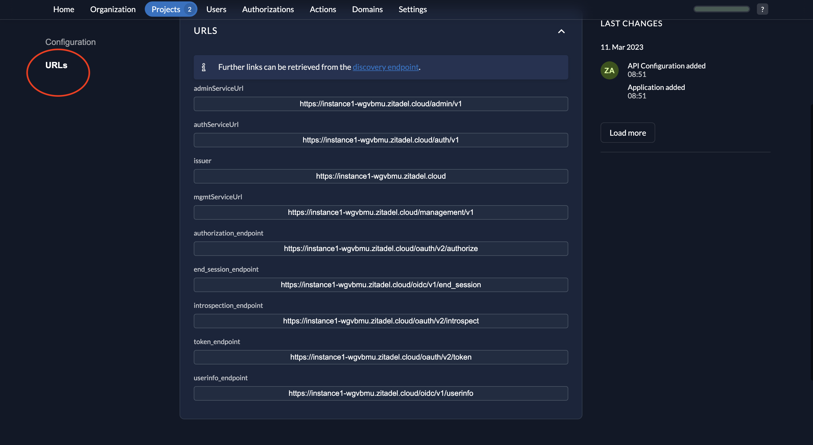
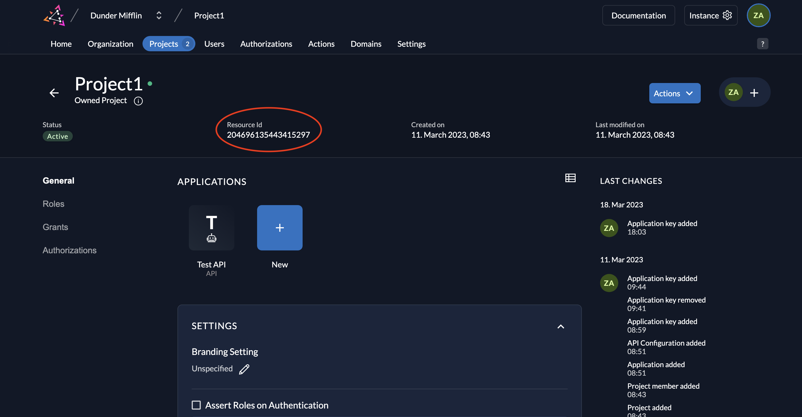

# Secure an API using Basic Authentication in ZITADEL 

## ToC
1. [Register the API in ZITADEL](#1)
2. [Run this API](#2)
3. [Invoke this API](#3)

## 1. Register the API in ZITADEL

1. Go to your Project and click on the **New** button as shown below. 

2.  Give a name to your application (Test API 2 is the name given below) and select type **API**. 

3. Select **Basic** as the authentication method and click **Continue**.  

4. Now review your configuration and click **Create**.   

5. You will now see the API’s **Client ID** and the **Client Secret**. Copy them and click **Close**.    

6. When you click **URLs** on the left, you will see the relevant OIDC URLs. Note down the **issuer** URL, **token_endpoint** and **introspection_endpoint**.  

7. Also note down the **Resource ID** of your project.   

## 2. Run this API 

The API has three routes:

- "/api/public" - No access token is required.
- "/api/private" - A valid access token is required.
- "/api/private-scoped" - A valid access token and a "read:messages" scope are required.

1. cd to this directory: `cd api-basic-authentication`
2. Replace the values of ZITADEL_DOMAIN, ZITADEL_INTROSPECTION_URL, API_CLIENT_ID and API_CLIENT_SECRET in the .env file with your values you obtained earlier. 
3. Run the API by running `python3 server.py` in the terminal. 

## 3. Invoke this API 

Obtain an access token as a ZITADEL service user via one of the following approaches (click the links to see instructions on how to obtain the token and invoke this API): 
- [JSON Web Token Profile](https://github.com/zitadel/examples-api-access-and-token-introspection/tree/main/service-user-jwt)
- [Client Credentials](https://github.com/zitadel/examples-api-access-and-token-introspection/tree/main/service-user-client-credentials) 
- [Personal Access Token](https://github.com/zitadel/examples-api-access-and-token-introspection/tree/main/service-user-pat)

