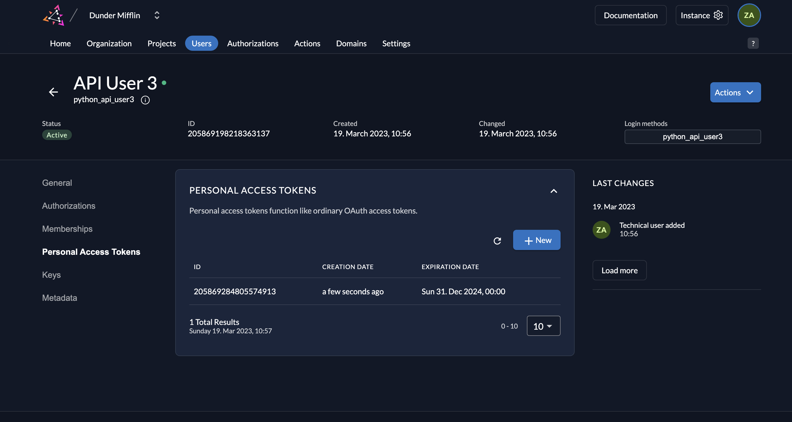

# Call a Secured API Using a Personal Access Token (PAT)

## ToC
1. [Prerequisites](#1)
2. [Create a Service User and Personal Access Token(PAT) in ZITADEL](#2)
3. [Invoke the API](#3)

## 1. Prerequisites 

You must have the backend API running and secured with one of the following ways (follow either link for instructions on how to set up and run the API): 

1. [JSON Web Token (JWT) Profile](https://github.com/zitadel/examples-api-access-and-token-introspection/tree/main/api-jwt)
2. [Basic Authentication](https://github.com/zitadel/examples-api-access-and-token-introspection/tree/main/api-basic-authentication)

## 2. Create a Service User with a Personal Access Token(PAT) in ZITADEL 

1. Go to the **Users** tab in your organization as shown below and click on the **Service Users** tab. To add a service user, click on the **New** button.

2. Next, add the details of the service user and select either **Bearer** or **JWT** for **Access Token Type** and click on **Create**. For this example, we will select **Bearer**.  

3. Click on **Personal Access Tokens**. 

4. You can create one or more PATs for your user. We will create one now. Click on **New**.  

5. Select an expiration date for the token or you can leave it empty. Click **Add**. 

6. Copy the generated access token and click **Close**.  

7. You will see the token listed for the service user.  

## 3. Invoke the API with Token

The API has three routes:

- "/api/public" - No access token is required.
- "/api/private" - A valid access token is required.
- "/api/private-scoped" - A valid access token and a "read:messages" scope are required.

1. Invoke the public resource using the following cURL command:

`curl -X GET http://localhost:5000/api/public`

You should get a response with Status Code 200 and the following message.

`{"message":"Public route - You don't need to be authenticated to see this."}`

2. Invoke the private resource:

Copy the Personal Access Token and assign it to a shell variable called TOKEN as shown below:

`TOKEN=<PAT>`

Invoke the private resource using the following cURL command

`curl -X GET -H "Authorization: Bearer $TOKEN" http://localhost:5000/api/private`

You should get a response with Status Code 200 and the following message.

`{"message":"Private route - You need to be authenticated to see this."}`

If you invoke the same resource without an access token (i.e., `curl -X GET http://localhost:5000/api/private`), you will see a 401 error. 

3. Invoke the private route that requires the user to have a certain role using the following cURL command: 

`curl -X GET -H "Authorization: Bearer $TOKEN" http://localhost:5000/api/private-scoped`

You should then get a Status Code 403, Forbidden error because the user does not have the role `read:messages`.

In order to access this route, you must create the role `read:messages` in your ZITADEL project and also create an authorization for the service user you created by adding the role to the user. Follow these [instructions](https://github.com/dakshitha/api-access-and-token-introspection/blob/main/service-user-jwt/README.md#41-create-a-role-and-assign-the-role-to-the-service-user-) to do so.  

Once you have assigned the role to the user, generate another PAT and invoke the protected resource with that PAT (remember to reset the TOKEN variable to the new PAT in the command line):  

`curl -X GET -H "Authorization: Bearer $TOKEN" http://localhost:5000/api/private-scoped`

You should get a response with Status Code 200 and the following message.

`{"message":"Private, scoped route - You need to be authenticated and have the role read:messages to see this."}`

